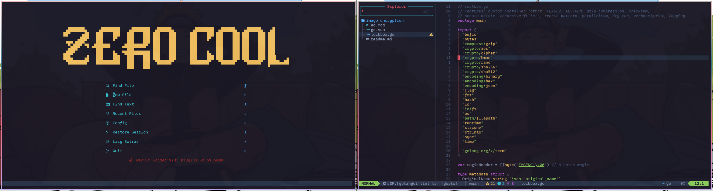

# 💤 LazyVim + My Dotfiles

Welcome to my personal Neovim setup powered by [LazyVim](https://www.lazyvim.org/)!
This repository contains my custom configurations, plugins, and tweaks to make Neovim a powerful, beautiful, and fun environment for coding and more. ✨

---

## 🚀 Features
- ⚡ Supercharged **LazyVim** setup for a modern editing experience
- 🎨 Beautiful theme, icons, and UI tweaks for a polished look
- 🛠️ Pre-configured plugins for coding, writing, and productivity
- 💻 Ready-to-use right out of the box with minimal setup

---

## 📥 Installation

### 1. Backup Your Current Neovim Config
Before proceeding, back up your existing Neovim configuration to avoid losing it:
```bash
mv ~/.config/nvim ~/.config/nvim.bak
```

### 2\. Clone This Repository

Clone this repo into your Neovim configuration directory:

bash

```
git clone https://github.com/shabbirToha/neovim ~/.config/nvim
```

### 3\. Install Dependencies

Ensure you have the following installed:

-   **Neovim** (>= 0.9)
-   **Git** (for cloning and managing plugins)
-   **Nerd Font** (for icons, e.g., JetBrains Mono Nerd Font)
-   **Node.js**, **Python**, and/or **Go** (for language-specific plugins like LSP)

* * * * *

▶️ Usage
--------

Open Neovim, and LazyVim will take care of the rest:

bash

```
nvim
```

On first launch, LazyVim will automatically install all plugins and apply the configuration. 🪄

* * * * *

⚡ Customization
---------------

Make this setup your own by tweaking the following:

-   **lua/config/**: Core options, keymaps, and custom tweaks
-   **lua/plugins/**: Plugin configurations
-   **lua/**: Additional custom scripts and settings

Explore these directories and modify them to suit your workflow!

* * * * *

🛠️ Updating
------------

Keep your plugins and configuration up to date with:

vim

```
:Lazy sync
```

* * * * *

📸 Peek at the Setup
--------------------

Here's my Neovim setup in action:




* * * * *

🎉 Fun Stuff
------------

-   Optimized for coding and *occasional* procrastination 😎
-   Feels like a terminal straight out of a hacker movie 💻🎬
-   Makes your keyboard come alive with every keystroke 🪄

* * * * *

🛠️ Troubleshooting
-------------------

-   **Icons not showing?** Ensure a Nerd Font is installed and set in your terminal emulator.
-   **Plugins not loading?** Run :Lazy sync to ensure all plugins are installed correctly.
-   **Need help?** Open an issue on this repo or check the [LazyVim documentation](https://www.lazyvim.org/).
